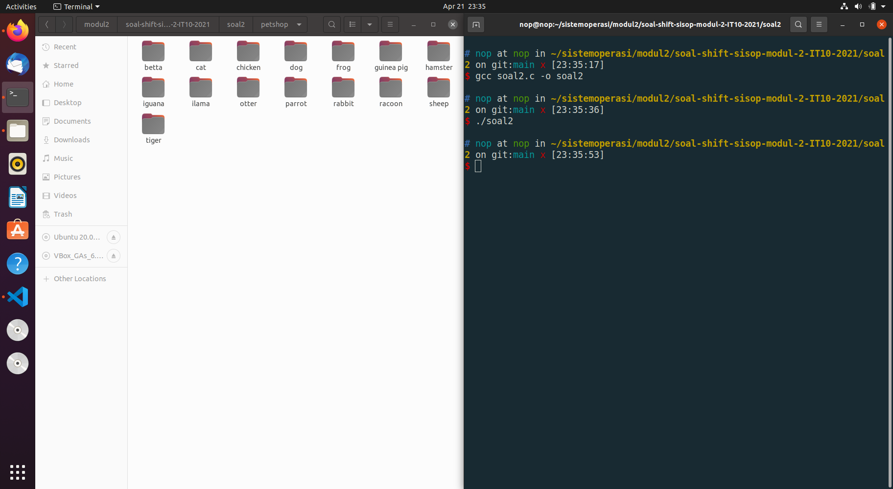

# soal-shift-sisop-modul-2-IT10-2021
## Anggota Kelompok
- Naufal Aprilian Marsa Mahendra 05311940000007
- Dian Arofati Nur Zamzamy 05311940000011
- Christopher Benedict 05311840000024
# Soal 1
Source Code : [soal1.c](soal1/soal1.c)
### Deskripsi
Pada suatu masa, hiduplah seorang Steven yang hidupnya pas-pasan. Steven punya pacar, namun sudah putus sebelum pacaran. Ketika dia galau memikirkan mantan, ia selalu menonton https://www.youtube.com/watch?v=568DH_9CMKI untuk menghilangkan kesedihannya. 

Di lain hal Steven anak yang tidak amat sangat super membenci matkul sisop, beberapa jam setelah diputus oleh pacarnya dia menemukan wanita lain bernama Stevany, namun Stevany berkebalikan dengan Steven karena menyukai sisop. Steven ingin terlihat jago matkul sisop demi menarik perhatian Stevany.

Pada hari ulang tahun Stevany, Steven ingin memberikan Stevany zip berisikan hal-hal yang disukai Stevany. Steven ingin isi zipnya menjadi rapi dengan membuat folder masing-masing sesuai extensi.
### Penyelesaian
## soal 1.a
### Deskripsi
Dikarenakan Stevany sangat menyukai huruf Y, Steven ingin nama folder-foldernya adalah Musyik untuk mp3, Fylm untuk mp4, dan Pyoto untuk jpg
### Penyelesaian
Untuk membuat program C yang berjalan di background, pertama harus melakukan #include terhadap library yang diperlukan
```
#include <sys/types.h>
#include <stdio.h>
#include <stdlib.h>
#include <unistd.h>
#include <time.h>
#include <wait.h>
#include <string.h>
#include <sys/stat.h>
```

- ```<sys/types.h>``` library tipe data khusus (e.g. pid_t)
- ```<stdio.h>``` library untuk fungsi input-output (e.g. printf(), sprintf())
- ```<stdlib.h>``` library untuk fungsi umum (e.g. exit(), atoi())
- ```<unistd.h> ```library untuk melakukan system call kepada kernel linux(e.g. fork())
- ```<time.h>``` library untuk melakukan manipulasi date dan time (e.g. time(), strftime())
- ```<wait.h>``` Library untuk melakukan wait (e.g. wait())
- ```<sys/stat.h>``` Libaryr untuk melakukan umask untuk mengubah mode file

Setelah itu, kami harus membuat program menjadi daemon.
```
    pid_t pid, sid;
    pid = fork();

    if (pid < 0) {
        exit(EXIT_FAILURE);
    }

    if (pid > 0) {
        exit(EXIT_SUCCESS);
    }
```
Pertama, kami akan melakukan fork(). sehingga menghasilkan parent process dengan variable pid berisi PID dari child processnya dan child process dengan variable pid berisi nilai 0. Lalu parent process akan di keluarkan menggunakan fungsi exit() dengan exit statusnya.

```
    umask(0);
    sid = setsid();
    if (sid < 0) {
        exit(EXIT_FAILURE);
    }
    close(STDIN_FILENO);
    close(STDERR_FILENO);
    close(STDOUT_FILENO);
```
Selanjutnya child process akan membuat session ID (sid) menggunakan fungsi setsid(). Lalu jika gagal, process tersebut akan dikeluarkan. Lalu process akan menutup file descriptor menggunakan fungsi close(). umask digunakan untuk mengatur permission dari suatu file pada saat file itu dibuat. Di sini kita mengatur nilai umask(0) agar kita mendapatkan akses full terhadap file yang dibuat oleh daemon. 

Disini Kita tinggal menggunakan ```mkdir``` menmggunakan execv yaitu folder Musyik, Fylm, Pyoto.
```
        child_id = fork();
        if (child_id == 0) {
        char *argv[] = {"mkdir", "Musyik","Fylm","Pyoto",NULL};
            execv("/bin/mkdir",argv);
        }
        while(wait(NULL) != child_id);
```
## soal 1.b
### Deskripsi
untuk musik Steven mendownloadnya dari link di bawah, film dari link di bawah lagi, dan foto dari link dibawah juga :).
### Penyelesaian
Menggunakan fork() untuk menciptakan child baru. Child akan menjalankan execv(). Disini tinggal mendownload seluruh filenya menggunakan wget dengan beberapa parameter yaitu:

```--no-check-certificate```

```-O``` untuk outputya

```-a``` untuk menyimpan lognya supaya mengetahui proses berhasil atau tidak

```
        child_id = fork();

        if (child_id == 0) {
            
        char *argv2[] = {"wget", "--no-check-certificate","https://drive.google.com/uc?id=1ZG8nRBRPquhYXq_sISdsVcXx5VdEgi-J&export=download","-O", "MUSIK.zip","-a","log",NULL};
        execv("/usr/bin/wget",argv2);
        }
        while(wait(NULL) != child_id);

        child_id = fork();

        if (child_id == 0) {
            
        char *argv3[] = {"wget", "--no-check-certificate","https://drive.google.com/uc?id=1ktjGgDkL0nNpY-vT7rT7O6ZI47Ke9xcp&export=download","-O","FILM.zip","-a","log",NULL};
        execv("/usr/bin/wget",argv3);
        }
        while(wait(NULL) != child_id);

        child_id = fork();

        if (child_id == 0) {
            
        char *argv4[] = {"wget","--no-check-certificate","https://drive.google.com/uc?id=1FsrAzb9B5ixooGUs0dGiBr-rC7TS9wTD&export=download","-O", "FOTO.zip","-a","log",NULL};
        execv("/usr/bin/wget",argv4);
        }
        
        while(wait(NULL) != child_id);
```
```while(wait(NULL) != child_id);``` Script tersebut dimaksudkan untuk menunggu proses child selesai terlebih dahulu lalu melanjutkan ke proses selanjutnya.

## soal 1.c
### Deskripsi
Steven tidak ingin isi folder yang dibuatnya berisikan zip, sehingga perlu meng-extract-nya setelah didownload serta
### Penyelesaian
Menggunakan fork() untuk menciptakan child baru. Child akan menjalankan execv(). Tinggal menggunakan perintah ```unzip``` pada execv nya. lalu tanda ```*``` menandakan semua file zip yang berada di direktori tersebut di unzip

```
        child_id = fork();

        if (child_id == 0) {
            char *argv5[] = {"/bin/unzip","*",NULL};
            execv("/bin/unzip",argv5);
        }   
        while(wait(NULL) != child_id); 
```
```while(wait(NULL) != child_id);``` Script tersebut dimaksudkan untuk menunggu proses child selesai terlebih dahulu lalu melanjutkan ke proses selanjutnya.
## soal 1.d
### Deskripsi
memindahkannya ke dalam folder yang telah dibuat (hanya file yang dimasukkan)
### Penyelesaian
Menggunakan fork() untuk menciptakan child baru. Child akan menjalankan execv(). Disini kami menggunakan ```find``` dikolaborasikan dengan mv. Find tersebut digunakan untuk mencari file apa saja yang terdapat pada direktori terkait. Ouput dari find akan dilakukan ```mv``` ke folder yang diinginkan. Untuk find menggunakan beberapa argumen yaitu
- ```-type f``` Argumen tersebut digunakan untuk mencari file saja bukan direktori
- ```-name *``` Arguman tersebut digunakan untuk 
```
        child_id = fork();

        if (child_id == 0) {
                char *argv8[] = {"find","FOTO","-type","f","-name","*","-exec","mv","-t","Pyoto/","{}","+",NULL};
                execv("/bin/find",argv8);
        }

        while(wait(NULL) != child_id);
        child_id = fork();

        if (child_id == 0) {
                char *argv9[] = {"find","MUSIK","-type","f","-name","*","-exec","mv","-t","Musyik/","{}","+",NULL};
                execv("/bin/find",argv9);
        }  
        while(wait(NULL) != child_id);

        child_id = fork();

        if (child_id == 0) {
                char *argv10[] = {"find","FILM","-type","f","-name","*","-exec","mv","-t","Fylm/","{}","+",NULL};
                execv("/bin/find",argv10);
        }
        while(wait(NULL) != child_id);
```

## soal 1.e
### Deskripsi
Untuk memudahkan Steven, ia ingin semua hal di atas berjalan otomatis 6 jam sebelum waktu ulang tahun Stevany).
## soal 1.f
### Deskripsi
Setelah itu pada waktu ulang tahunnya Stevany, semua folder akan di zip dengan nama Lopyu_Stevany.zip dan semua folder akan di delete(sehingga hanya menyisakan .zip).
### Penyelesaian
### Kendala
Tidak Ada

### Screenshot
Ketika dijalankan tetapi waktu masih belum diatur ke 2021-04-09 16:22:00


sudo date --set="2021-04-09 16:22:00"


sudo date --set="2021-04-09 22:22:00"


Isi Folder Fylm


Isi Folder Musyik


Isi Folder Pyoto


# Soal 2
Source Code : [soal2.c](soal2/soal2.c)
### Deskripsi
Loba bekerja di sebuah petshop terkenal, suatu saat dia mendapatkan zip yang berisi banyak sekali foto peliharaan dan Ia diperintahkan untuk mengkategorikan foto-foto peliharaan tersebut. Loba merasa kesusahan melakukan pekerjaanya secara manual, apalagi ada kemungkinan ia akan diperintahkan untuk melakukan hal yang sama. Kamu adalah teman baik Loba dan Ia meminta bantuanmu untuk membantu pekerjaannya.
## soal 2.a
### Deskripsi
Pertama-tama program perlu mengextract zip yang diberikan ke dalam folder “/home/[user]/modul2/petshop”. Karena bos Loba teledor, dalam zip tersebut bisa berisi folder-folder yang tidak penting, maka program harus bisa membedakan file dan folder sehingga dapat memproses file yang seharusnya dikerjakan dan menghapus folder-folder yang tidak dibutuhkan.
### Penyelesaian
Hal pertama yang harus dilakukan adalah melakukan #include terhadap library yang diperlukan
```
#include <sys/types.h>
#include <sys/stat.h>
#include <stdio.h>
#include <stdlib.h>
#include <unistd.h>
#include <string.h>
#include <wait.h>
#include <dirent.h>
#include <errno.h>
```
- ```<sys/types.h>``` library tipe data khusus (e.g. pid_t)
- ```<sys/stat.h>``` Libary untuk melakukan umask untuk mengubah mode file
- ```<stdio.h>``` library untuk fungsi input-output (e.g. printf(), sprintf())
- ```<stdlib.h>``` library untuk fungsi umum (e.g. exit(), atoi())
- ```<unistd.h> ```library untuk melakukan system call kepada kernel linux(e.g. fork())
- ```<string.h> ```library untuk melakukan berbau hal dengan string seperti(strcpy(),strcat())
- ```<wait.h>``` Library untuk melakukan wait (e.g. wait())
- ```<dirent.h>``` Library untuk melakukan reading directory
- ```<errno.h>``` Library untuk mendefinisikan variabel integer errno, yang diatur oleh panggilan sistem dan beberapa fungsi untuk menunjukkan apa yang salah.

Setelah itu masuk ke direktori pethop dengan menggunakan ```chdir()```. Membuat proses baru child dengan menggunakan ```fork()```. Jika proses merupakan child maka lakukan ```execv``` ```unzip``` pada file pets.zip dengan parameter berikut:
- ```-q``` untuk quiet mode

Setelah itu membuat proses baru yang menjalankan ```execv``` command ```rm``` untuk menghapus file pets.zip
```
    char pathdirectory[] = "/home/nop/sistemoperasi/modul2/soal-shift-sisop-modul-2-IT10-2021/soal2/petshop/";
    pid_t child_id;
    if ((chdir(pathdirectory)) < 0) {
        exit(EXIT_FAILURE);
    }
    child_id = fork();
    // soal 2a
    if (child_id == 0) {
        char filename[50]="pets.zip";
        char *argv[] = {"unzip","-q", filename, NULL};
        execv("/bin/unzip", argv);
    }
    while(wait(NULL) != child_id);
    child_id = fork();
    if (child_id == 0) {
        char *argv[] = {"rm", "pets.zip", NULL};
        execv("/bin/rm", argv);
    }
    while(wait(NULL) != child_id);
```
Disini kami membuat list file apa saja yang ada pada direktori petshop. Pertama melakukanb ```opendir``` pada direktori ```petshop```. Setelah itu melakukan while untuk membaca nama file atau direktori yang ada. List tersebut dimasukkan ke f_name kecuali folder ```.``` dan ```..```.
```
    DIR *dp;
    struct dirent *ep;
    char f_name[1000];
    memset(f_name, 0, sizeof f_name);
    dp = opendir(pathdirectory);

    if (dp != NULL)
    {
      while ((ep = readdir (dp))) {
        if (strcmp(ep->d_name, ".") == 0 || strcmp(ep->d_name, "..") == 0) {
            continue;
        }
         sprintf(f_name+strlen(f_name), "%s\n", ep->d_name);
          
      }
      (void) closedir (dp);
    } else perror ("Couldn't open the directory");

    char *token = strtok(f_name, "\n");
```
Setelah itu kami menggunakan ```strtok()``` untuk melakukan split pada ```fname``` berdasarkan ```\n```. dan kami menyiapkan char double pointer untuk menyimpan nama file secara berurutan menggunakan while() sampai fname habis karena ```strtok()```. Dalam while tersebut juga melihat jika merupakan sebuah direktori maka akan membut proses child baru menggunakan ``fork()`` lalu melakukan ```rm``` pada direktori tersebut karena tidak diperlukan.
```
    char *token = strtok(f_name, "\n");
    char **filenamepath = malloc(55*sizeof(char *));
    char **filenamepathtemp = malloc(55*sizeof(char *));
    
    int num=0;
    while (token != NULL) {
        // puts(token);
        char location[256];
        struct stat location_stat;
        strcpy(location,pathdirectory);
        strcat(location,token);
        
        stat(location, &location_stat);

        // direktori
        
        if (S_ISDIR(location_stat.st_mode)) {
            child_id = fork();
            if (child_id == 0) {
                char *argv[] = {"rm","-r", token, NULL};
                execv("/bin/rm", argv);
            }
        while(wait(NULL) != child_id);
        
        }else{
            if (strstr (token,"_") != NULL)
            {  
                filenamepath[num] = token;  
                filenamepathtemp[num]= token;
                num++;
                filenamepath[num] = token; 
                filenamepathtemp[num]= token;  
                num++;
            }else{
                filenamepath[num] = token; 
                filenamepathtemp[num]= token;  
                num++;
                
            }

        }
        token = strtok(NULL, "\n");
     }
```
Kita melakukan while sampai mencapai jumlah file yang terlist di array sebelumnya. Disini kita membuat char ```kategori``` , ```nama``` , ```umur``` untuk menyimpan list hewan sesuai dengan nama file yang ada. Disini terdapat kasus dimana ada ```_``` pada nama file yang mengandung 2 hewan. Ketika bertemu nama file ```_``` maka akan dilakukan pengisian 2 array supaya jumlah array masih sama dengan char ```filenamepath```. Disini kita menggunakan ```strtok()``` untuk melakukan split supaya mendapatkan ```kategori```, ```nama```, ```umur```.
```
            char kategori[num][100];
            char nama[num][100];
            char umur[num][100];
            int i=0;
            int k =0;
            while(i < num)
            {
                if (strstr (filenamepath[i],"_") != NULL)
                {
                    char temp[100];
                    strcpy(temp,filenamepathtemp[i]);

                    char *token2  = strtok(temp,";");
                        while (token2 != NULL) {

                            strcpy(kategori[i],token2);
                            token2 = strtok(NULL,";");                            

                            strcpy(nama[i],token2);
                            token2 = strtok(NULL,"_");

                            strcpy(umur[i],token2);
                            i = i+1;
                            token2 = strtok(NULL,";");

                            strcpy(kategori[i],token2);
                            token2 = strtok(NULL,";");

                            strcpy(nama[i],token2);
                            token2 = strtok(NULL,";");

                            strncpy(umur[i],token2,strlen(token2)-4);
                            
                            token2 = NULL;
                            
                        }
                }else{
                    char temp[100];
                    strcpy(temp,filenamepathtemp[i]);
                    char *token2  = strtok(temp,";");
                        while (token2 != NULL) {

                            strcpy(kategori[i],token2);
                            token2 = strtok(NULL,";");

                            strcpy(nama[i],token2);
                            token2 = strtok(NULL,";");

                            strncpy(umur[i],token2,strlen(token2)-4);
                            
                            token2 = NULL;
                            
                        } 
                }
                i = i+1;
            }
```
## soal 2.b
### Deskripsi
Foto peliharaan perlu dikategorikan sesuai jenis peliharaan, maka kamu harus membuat folder untuk setiap jenis peliharaan yang ada dalam zip. Karena kamu tidak mungkin memeriksa satu-persatu, maka program harus membuatkan folder-folder yang dibutuhkan sesuai dengan isi zip.
Contoh: Jenis peliharaan kucing akan disimpan dalam “/petshop/cat”, jenis peliharaan kura-kura akan disimpan dalam “/petshop/turtle”.
### Penyelesaian
Disini kami melakukan for looping dengan batas jumlah file yang ada yang diwakili ```num```. Disini kita melakukan ```opendir``` . ketika direktori belum ada maka akan dilakukan pembuatan proses dari dengan ```fork()``` dan melakukan ```execv``` dengan command ```mkdir```.
```
            for (int j = 0; j < num; j++)
            {

                    char direktori[100];
                    strcpy(direktori,kategori[j]); 
                    DIR* dir = opendir(direktori);
                    if (dir) {
                        closedir(dir);
                    } else if (ENOENT == errno) {
                        child_id = fork();
                        if (child_id == 0) {
                            char *argv[] = {"mkdir", direktori, NULL};
                            execv("/bin/mkdir", argv);
                        }
                        while(wait(NULL) != child_id);
                    }
                    ...
            }
            
    return 0;
}
```
## soal 2.c
### Deskripsi
Setelah folder kategori berhasil dibuat, programmu akan memindahkan foto ke folder dengan kategori yang sesuai dan di rename dengan nama peliharaan.
Contoh: “/petshop/cat/joni.jpg”. 
### Penyelesaian
Disini akan melakukan command mv dari ```filenamepath``` ke ```path``` yang merupaka. nama hewan dan dimasukkan ke folder susuai kategorinya. Untuk kasus file yang ada ``_`` pertama akan dilakukan ```cp``` untuk hewan pertama dan akan dilakukan ```mv``` pada hewan kedua.

```
            for (int j = 0; j < num; j++)
            {
                    ...
                    if (dir) {
                        ...
                    } else if (ENOENT == errno) {
                        child_id = fork();
                        if (child_id == 0) {
                            ...
                        }
                        ...
                    }
                    if (strstr (filenamepath[j],"_") != NULL){
                        child_id = fork();
                        if (child_id == 0) {
                            char path[100];
                            strcpy(path,direktori);
                            strcat(path,"/");
                            strcat(path,nama[j]);
                            strcat(path,".jpg");
                            char *argv[] = {"cp", filenamepath[j],path, NULL};
                            execv("/bin/cp", argv);
                        }
                            ...
                        child_id = fork();
                        if (child_id == 0) {
                            char path[100];
                            strcpy(path,kategori[j]);
                            strcat(path,"/");
                            strcat(path,nama[j]);
                            strcat(path,".jpg");
                            char *argv[] = {"mv", filenamepath[j],path, NULL};
                            execv("/bin/mv", argv);
                        }
                            while(wait(NULL) != child_id);
                    }else{
                        child_id = fork();
                        if (child_id == 0) {
                            char path[100];
                            strcpy(path,direktori);
                            strcat(path,"/");
                            strcat(path,nama[j]);
                            strcat(path,".jpg");
                            char *argv[] = {"mv", filenamepath[j],path, NULL};
                            execv("/bin/mv", argv);
                        }
                            while(wait(NULL) != child_id);
                    }
                    ...
            }
            
    return 0;
}
```
## soal 2.d
### Deskripsi
Karena dalam satu foto bisa terdapat lebih dari satu peliharaan maka foto harus di pindah ke masing-masing kategori yang sesuai. Contoh: foto dengan nama “dog;baro;1_cat;joni;2.jpg” dipindah ke folder “/petshop/cat/joni.jpg” dan “/petshop/dog/baro.jpg”.
### Penyelesaian
Untuk penyelesaian ini bisa dilihat pada penyelesaian 2.c karena sudah dijelaskan disana juga.
## soal 2.e
### Deskripsi
Di setiap folder buatlah sebuah file "keterangan.txt" yang berisi nama dan umur semua peliharaan dalam folder tersebut. Format harus sesuai contoh.
```
nama : joni
umur  : 3 tahun

nama : miko
umur  : 2 tahun

```
### Penyelesaian
Disini menggunakan ```FILE *pFile;``` untuk membuat filenya. Lalu menggunakan ```fprintf(pFile, inp, nama[j],umur[j]);``` untuk mengisi list nama hewannya. Disini terdapat kasus jika nama filenya mengandung ```_``` maka akan dilakukan penulisan keterangan hewan pertama lalu dilakukan increment. Setelah itu dilakukan penulisan keterangan hewan kedua.
```
            for (int j = 0; j < num; j++)
            {
                    char direktori[100];
                    strcpy(direktori,kategori[j]); 
                    DIR* dir = opendir(direktori);
                    if (dir) {
                        closedir(dir);
                    } else if (ENOENT == errno) {
                        child_id = fork();
                        if (child_id == 0) {
                            ...
                        }
                        ...
                    }
                    if (strstr (filenamepath[j],"_") != NULL){
                        child_id = fork();
                        if (child_id == 0) {
                            ...
                        }
                            ...
                            FILE *pFile;
                            char pathketerangan[100];
                            strcpy(pathketerangan,kategori[j]);
                            strcat(pathketerangan,"/keterangan.txt");
                            pFile = fopen(pathketerangan, "a+");
                                char *inp = ""
                                "nama: %s\n"
                                "umur: %s tahun\n\n";
                            fprintf(pFile, inp, nama[j],umur[j]);
                            fclose(pFile);
                        j = j+1;
                        child_id = fork();
                        if (child_id == 0) {
                            ...
                        }
                            ...
                    }else{
                        child_id = fork();
                        if (child_id == 0) {
                            ...
                        }
                            ...
                    }
                    
                    FILE *pFile;
                    char pathketerangan[100];
                    strcpy(pathketerangan,kategori[j]);
                    strcat(pathketerangan,"/keterangan.txt");
                    pFile = fopen(pathketerangan, "a+");
                        char *inp = ""
                        "nama: %s\n"
                        "umur: %s tahun\n\n";
                    fprintf(pFile, inp, nama[j],umur[j]);
                    fclose(pFile);
            }
            
    return 0;
}
```
### Kendala
Tidak Ada

### Screenshot
Sebelum Program dijalankan


Setelah program dijalankan



Contoh Isi dari keterangan.txt


# Soal 3
Source Code : [soal3.c](soal3/soal3.c)
### Deskripsi
Ranora adalah mahasiswa Teknik Informatika yang saat ini sedang menjalani magang di perusahan ternama yang bernama “FakeKos Corp.”, perusahaan yang bergerak dibidang keamanan data. Karena Ranora masih magang, maka beban tugasnya tidak sebesar beban tugas pekerja tetap perusahaan. Di hari pertama Ranora bekerja, pembimbing magang Ranora memberi tugas pertamanya untuk membuat sebuah program.

## soal 3.a
### Deskripsi
Ranora harus membuat sebuah program C yang dimana setiap 40 detik membuat sebuah direktori dengan nama sesuai timestamp [YYYY-mm-dd_HH:ii:ss].
### Penyelesaian


Pertama melakukan ```#include``` header library yang diperlukan
- ```<sys/types.h>``` library tipe data khusus (e.g. pid_t)
- ```<sys/stat.h>``` Libary untuk melakukan umask untuk mengubah mode file
- ```<stdio.h>``` library untuk fungsi input-output (e.g. printf(), sprintf())
- ```<stdlib.h>``` library untuk fungsi umum (e.g. exit(), atoi())
- ```<unistd.h> ```library untuk melakukan system call kepada kernel linux(e.g. fork())
- ```<string.h> ```library untuk melakukan berbau hal dengan string seperti(strcpy(),strcat())
- ```<wait.h>``` Library untuk melakukan wait (e.g. wait())
- ```<time.h>``` library untuk melakukan manipulasi date dan time (e.g. time(), strftime())

```
#include <sys/types.h>
#include <stdio.h>
#include <stdlib.h>
#include <unistd.h>
#include <time.h>
#include <wait.h>
#include <string.h>
#include <sys/stat.h>
```
Membuat loop utama ```while(1)```, yang akan terus berulang setiap 40 detik dengan blocking menggunakan fungsi ```sleep()```. Pada saat looping, yang pertama adalah mendapatkan timestamp localtime, yang akan disimpan pada variabel currentTime dengan format [YYYY-mm-dd_HH:ii:ss] dengan menggunakan fungsi ```strftime()```. 

Menggunakan ```fork()``` untuk menciptakan child baru. Child akan menjalankan ```execv()```. Kemudian membuat direktori dengan perintah ```mkdir``` dengan nama sesuai currentTime.
```
while(1){
        time_t t = time(NULL);
        struct tm *tm = localtime(&t);
        char currentTime[80]; 
        strftime(currentTime, sizeof(currentTime)-1, "%Y-%m-%d_%H:%M:%S", tm);

        pid_t child_id;
        child_id = fork();
        // membuat direktori soal 3a
        if (child_id == 0) {
        char *argv[] = {"mkdir", currentTime, NULL};
        execv("/bin/mkdir", argv); //membuat direktori dengan perintah mkdir dengan nama sesuai currenttime
        }
	//soal 3b
	//soal 3c
	.
	.
	.
	Sleep(40);
}
```
## soal 3.b
### Deskripsi
Setiap direktori yang sudah dibuat diisi dengan 10 gambar yang didownload dari https://picsum.photos/, dimana setiap gambar akan didownload setiap 5 detik. Setiap gambar yang didownload akan diberi nama dengan format timestamp [YYYY-mm-dd_HH:ii:ss] dan gambar tersebut berbentuk persegi dengan ukuran (n%1000) + 50 pixel dimana n adalah detik Epoch Unix.
### Penyelesaian
Menggunakan ```fork()``` untuk menciptakan child baru. Child akan menjalankan ```execv()``` dan menggunakan perintah wget untuk mendownload gambar. Dan dilakukan looping sebanyak 10 kali menggunakan for loop, yang pertama dilakukan adalah mendapatkan timestamp untuk memberi nama file yang didownload, kemudian menentukan file path untuk menyimpan file yang didownload, yaitu pada folder yang sudah dibuat dengan nama folder currentTime (soal 3a) menggunakan fungsi ```sprintf()```. Untuk menentukan ukuran gambar yaitu dengan menambahkan ukuran yang ditentukan di akhir url. Kemudian gambar akan didownload menggunakan perintah ```wget``` dengan parameter:

```-o``` untuk outputnya

```-a``` untuk menyimpan lognya supaya mengetahui proses berhasil atau tidak

Dan akan berulang setiap 5 detik dengan menggunakan fungsi ```sleep()```.
```
child_id = fork();
if (child_id == 0) {
    for (int i = 0; i < 10; i++) {
	child_id = fork();
	if (child_id == 0) {
	    t = time(NULL);
	    tm = localtime(&t);
	    char new_currentTime[80], FilePath[160], link[80];
	    strftime(new_currentTime, 80, "%Y-%m-%d_%H:%M:%S", tm);
	    sprintf(FilePath, "%s/%s", currentTime, new_currentTime);
	    sprintf(link, "https://picsum.photos/%ld", ((t%1000)+50));
	    char *argv[] = {"wget","-O", FilePath, link,"-a","log", NULL};
	    execv("/usr/bin/wget", argv);
	}
	sleep(5);
    }
    // soal 3c
}
```
## soal 3.c
### Deskripsi
Setelah direktori telah terisi dengan 10 gambar, program tersebut akan membuat sebuah file “status.txt”, dimana didalamnya berisi pesan “Download Success” yang terenkripsi dengan teknik Caesar Cipher dan dengan shift 5. Caesar Cipher adalah Teknik enkripsi sederhana yang dimana dapat melakukan enkripsi string sesuai dengan shift/key yang kita tentukan. Misal huruf “A” akan dienkripsi dengan shift 4 maka akan menjadi “E”. Karena Ranora orangnya perfeksionis dan rapi, dia ingin setelah file tersebut dibuat, direktori akan di zip dan direktori akan didelete, sehingga menyisakan hanya file zip saja.
### Penyelesaian
Setelah selesai mendownload sebanyak 10 gambar, kemudian membuat message “Download Succes” dan dienkripsi menggunakan Caesar chipper dengan shift/key 5.
```
while(wait(NULL) >0);
child_id = fork();
if (child_id == 0) {
char message[100]="Download Success", ch;
int i, key=5;
// encrypt message
for(i = 0; message[i] != '\0'; ++i){
    ch = message[i];

    if(ch >= 'a' && ch <= 'z'){
	ch = ch + key;

	if(ch > 'z'){
	    ch = ch - 'z' + 'a' - 1;
	}

	message[i] = ch;
    }
    else if(ch >= 'A' && ch <= 'Z'){
	ch = ch + key;

	if(ch > 'Z'){
	    ch = ch - 'Z' + 'A' - 1;
	}

	message[i] = ch;
    }
}
```
Kemudian membuat file status.txt di dalam folder currentTime dan file status.txt diisi dengan message yang sudah dienkripsi menggunakan fungsi ```fopen()``` dengan mode ```a+ ```yang berarti reading dan appending.
```
	FILE *file;
               
 	char name[100];
                strcpy(name,currentTime);
                strcat(name,"/status.txt");
                file = fopen(name,"a+");
                fprintf(file,"%s",message);
                fclose(file);
```
Setelah file berhasil dibuat dan diisi message dilanjutkan dengan zip folder tersebut dengan menggunakan ```execv()``` dan perintah ```zip``` dengan parameter

```-r``` untuk zip secara rekursif pada direktori
```
	char filezip[100];
	strcpy(filezip,currentTime);
	strcat(filezip,".zip");

	char *argv[] = {"zip","-r", filezip, currentTime,NULL};
	execv("/bin/zip", argv);
```
Setelah selesai di zip, selanjutnya adalah menghapus direktori menggunakan ```execv()``` dan perintah ```rm``` dengan parameter

```-r``` untuk menghapus direktori sekaligus semua isi pada direktori
```
while(wait(NULL) != child_id);
    char *argv[] = {"rm", "-r", currentTime,"log",NULL};
    execv("/bin/rm", argv);
```
## soal 3.d
### Deskripsi
Untuk mempermudah pengendalian program, pembimbing magang Ranora ingin program tersebut akan men-generate sebuah program “Killer” yang executable, dimana program tersebut akan menterminasi semua proses program yang sedang berjalan dan akan menghapus dirinya sendiri setelah program dijalankan. Karena Ranora menyukai sesuatu hal yang baru, maka Ranora memiliki ide untuk program “Killer” yang dibuat nantinya harus merupakan program bash.
### Penyelesaian
Membuat file kosong killer.sh untuk menghentikan proses dengan mode ```w``` write
```
FILE *fileKiller;
        fileKiller = fopen("killer.sh", "w");
	.
	//soal 3e
	.
fclose(fileKiller);
    pid = fork();
  if (pid == 0) {
    char *argv[] = {"chmod","+x","killer.sh", NULL};
    execv("/bin/chmod", argv);
```
Menggunakan ```fork()``` untuk menciptakan parent process. Menggunakan ```execv()``` dan perintah ```chmod``` dengan parameter ```+x``` untuk menambah permission file agar executable
## soal 3.e
### Deskripsi
Pembimbing magang Ranora juga ingin nantinya program utama yang dibuat Ranora dapat dijalankan di dalam dua mode. Untuk mengaktifkan mode pertama, program harus dijalankan dengan argumen -z, dan Ketika dijalankan dalam mode pertama, program utama akan langsung menghentikan semua operasinya Ketika program Killer dijalankan. Sedangkan untuk mengaktifkan mode kedua, program harus dijalankan dengan argumen -x, dan Ketika dijalankan dalam mode kedua, program utama akan berhenti namun membiarkan proses di setiap direktori yang masih berjalan hingga selesai (Direktori yang sudah dibuat akan mendownload gambar sampai selesai dan membuat file txt, lalu zip dan delete direktori).
### Penyelesaian
Menginput program bash pada file killer.sh. Apabila program utama dijalankan dengan argument -z maka file killer.sh, menggunakan fungsi ```fprintf()```, diisi dengan perintah ```pkill -9 -s sid``` untuk menghentikan paksa program yang berjalan dan kemudian menghapus file killer.sh tersebut.
```
if (strcmp(argv[1], "-z") == 0) {
    char *contents = ""
    "#!/bin/bash\n"
    "/usr/bin/pkill -9 -s \"%d\"\n"
    "/bin/rm killer.sh";
    fprintf(fileKiller, contents, sid);
  }
 ```
Sedangkan apabila program utama dijalankan dengan argument -x maka file killer.sh diisi dengan ```kill -9 getpid()``` untuk menghentikan program yang berjalan tetapi masih membiarkan proses yang terjadi di direktori hingga selesai.
```
  if (strcmp(argv[1], "-x") == 0) {
    char *contents = ""
    "#!/bin/bash\n"
    "/usr/bin/kill -9 \"%d\"\n"
    "/bin/rm killer.sh";
    fprintf(fileKiller, contents, getpid());
  }
```
### Kendala
Tidak Ada

### Screenshot
Menjalankan program dengan menambahkan argumen -z yang mengakibatkan seluruh proses langsung berhenti


Menjalankan program dengan menambahkan argumen -x yang akan kill proses parent dan membiarkan child menjalankan proses sampai selesai


